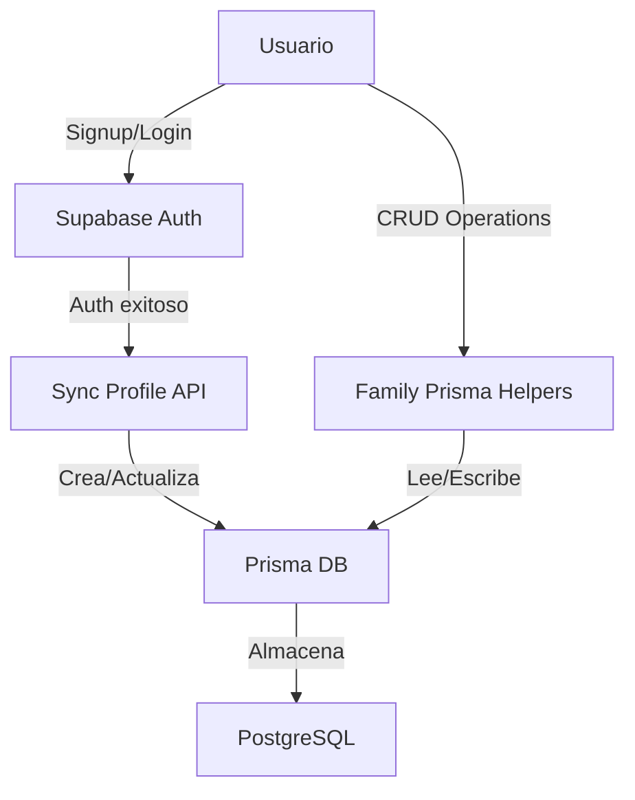

# Supabase Auth + Prisma Integration

## Resumen
Has integrado exitosamente Supabase Auth con Prisma ORM, manteniendo la autenticación de Supabase mientras usas Prisma para gestionar los datos de usuarios y árboles genealógicos.

## Arquitectura



## Archivos Creados

### 1. `/lib/auth-prisma.ts`
Funciones para sincronizar usuarios de Supabase Auth con perfiles de Prisma:
- `syncUserProfile()` - Crea perfil en Prisma después del registro
- `getUserProfile()` - Obtiene perfil completo con family members
- `updateUserProfile()` - Actualiza datos del perfil
- `deleteUserProfile()` - Elimina perfil (cascada)

### 2. `/app/api/auth/sync-profile/route.ts`
API route que sincroniza usuarios:
- Llamado automáticamente después de `signUp()`
- Crea entrada en tabla `profiles` con el ID de Supabase Auth

### 3. `/lib/family-prisma.ts`
Helpers para gestionar miembros de la familia usando Prisma:
- `getFamilyMembers()` - Lista todos los miembros
- `createFamilyMember()` - Crea nuevo miembro
- `updateFamilyMember()` - Actualiza miembro existente
- `deleteFamilyMember()` - Elimina miembro
- `getRelationships()` - Obtiene relaciones familiares
- `createRelationship()` - Crea nueva relación
- `deleteRelationship()` - Elimina relación

## Archivos Modificados

### `/lib/supabase-client.ts`
- Actualizada función `signUp()` para sincronizar con Prisma después del registro
- La función ahora llama a `/api/auth/sync-profile` automáticamente

## Flujo de Registro

1. Usuario completa formulario de registro
2. `signUp()` crea usuario en Supabase Auth
3. Si exitoso, llamada automática a `/api/auth/sync-profile`
4. API crea perfil en Prisma con el mismo UUID de Supabase
5. Usuario ahora existe en ambos sistemas

## Uso

### Registro de Usuario
```typescript
import { signUp } from '@/lib/supabase-client';

const { data, error } = await signUp(
  'user@example.com',
  'password123',
  'John Doe'
);
// ✅ Usuario creado en Supabase Auth
// ✅ Perfil creado automáticamente en Prisma
```

### Obtener Perfil
```typescript
import { getUserProfile } from '@/lib/auth-prisma';

const { profile, error } = await getUserProfile(userId);
// profile incluye familyMembers relacionados
```

### Crear Miembro de Familia
```typescript
import { createFamilyMember } from '@/lib/family-prisma';

const { data, error } = await createFamilyMember(userId, {
  firstName: 'María',
  lastName: 'García',
  birthDate: new Date('1950-05-15'),
  gender: 'female',
});
```

## Ventajas de Esta Arquitectura

✅ **Autenticación robusta**: Usa Supabase Auth (OAuth, MFA, etc.)  
✅ **Type-safety**: Prisma proporciona tipos TypeScript completos  
✅ **Relaciones complejas**: Prisma maneja relaciones familiares fácilmente  
✅ **Migraciones**: Prisma Migrate para control de versiones del schema  
✅ **Sincronización automática**: Los perfiles se crean automáticamente

## Próximos Pasos

### Configuración de Base de Datos
1. Asegúrate de tener las variables de entorno:
```env
DATABASE_URL="postgresql://..."
NEXT_PUBLIC_SUPABASE_URL="https://..."
NEXT_PUBLIC_SUPABASE_ANON_KEY="..."
```

2. Ejecuta las migraciones de Prisma:
```bash
npx prisma migrate dev
```

### Testing
Prueba el flujo completo:
1. Registra un nuevo usuario
2. Verifica que se creó el perfil en la base de datos
3. Crea miembros de familia
4. Verifica relaciones

### Middleware (Opcional)
Puedes crear middleware para proteger rutas:
```typescript
// middleware.ts
import { createMiddlewareClient } from '@supabase/auth-helpers-nextjs';

export async function middleware(req: NextRequest) {
  const supabase = createMiddlewareClient({ req, res });
  const { data: { session } } = await supabase.auth.getSession();
  
  if (!session) {
    return NextResponse.redirect(new URL('/auth/login', req.url));
  }
}
```

## Notas Importantes

⚠️ **UUID Consistency**: El ID del perfil en Prisma DEBE coincidir con el UUID de Supabase Auth  
⚠️ **Error Handling**: La sincronización falla silenciosamente para no bloquear el registro  
⚠️ **Cascada**: Eliminar un perfil elimina todos sus family members y relationships
